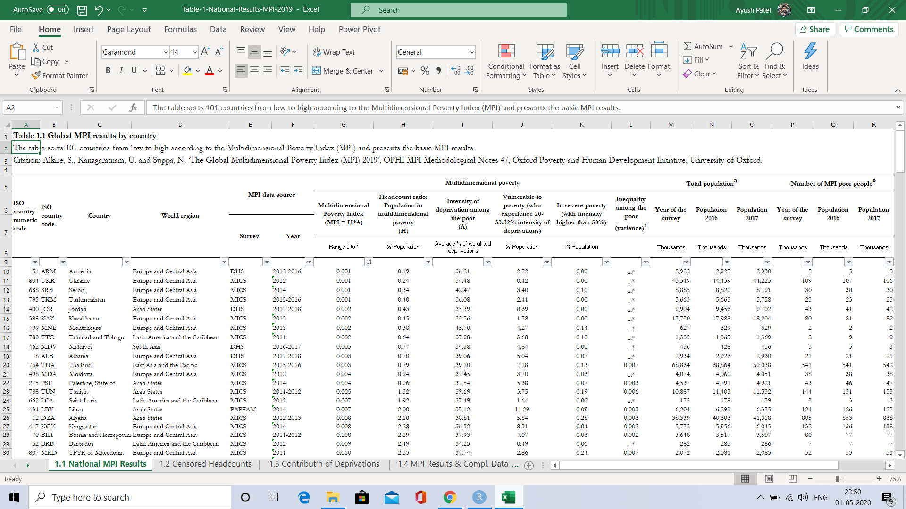
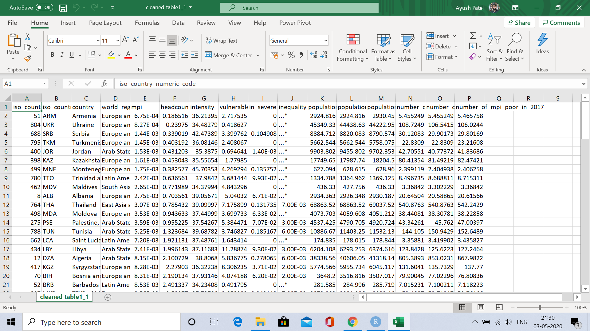

Where is the data from?
----

The data is available on the website of OPHI. This is the [link](https://ophi.org.uk/multidimensional-poverty-index/mpi-resources/).

The Table 1 has national MPI results for the year 2019.

Libraries 
---

```{r}
library(here) ### if you do not do this Jenny Bryan sets your computer on fire
library(janitor)
library(tidyverse)
library(readxl)
```

To know why I use {here}, go to this [link](https://www.tidyverse.org/blog/2017/12/workflow-vs-script/)

Importing Data
---

The Table 1 has 7 sheets. names and numbered as following (as given in the excel file):

__1.1 National MPI Results:__

The table sorts 101 countries from low to high according to the Multidimensional Poverty Index (MPI) and presents the basic MPI results. 

__1.2 Censored Headcounts__

The table shows the proportion of people who are MPI poor and experience deprivations in each of the indicators. The table sorts 101 countries from low to high according to the Multidimensional Poverty Index (MPI). 

__1.3 Contribution of Deprivation__

The table shows the percentage contribution of each dimension and indicator to the MPI. The table sorts 101 countries from low to high according to the Multidimensional Poverty Index (MPI). 

__1.4 MPI Results and complete data__

The table sorts 101 countries from low to high according to their Multidimensional Poverty Index (MPI) score and compares that with external data such as income poverty figures, GNI per capita, Gini Index, HDI rank and income category. 

__1.5 SEs and CIs__

The table sorts countries from low to high according to the Multidimensional Poverty Index (MPI) and presents the standard errors and confidence intervals for the MPI and the headcount ratio. 

__1.6 Raw Headcounts__

The table shows the proportion of people who experience deprivations in each of the indicators. The table sorts 101 countries from low to high according to the Multidimensional Poverty Index (MPI). 

__1.7 Sample size and Non-Response__

The table reports the sample sizes from each survey that were used to compute the MPI. Reductions in sample sizes were due to missing data, as detailed in the columns by indicator. The table sorts 101 countries from low to high according to the Multidimensional Poverty Index (MPI).  


From these 7 sheets the first 4 will be data of our focus. I will import and clean only the first 4 sheets.


### Importing 1.1 National MPI Results.

Before writing code for the data I like to open in it excel just to get the feel. One can do this from RStudi as well, however, I prefer looking at the data once in excel id possible. Here is how the data looks.



As one can see that in order to improt the data in a clean manner we will need to skip some inintial rows. Moreover, we will have to think of how to deal with merged cells in the header or column name.

One way of dealing with this is skipping first 9 rows and naming the columns in the next step. This sounds tedious though. The tediousness would become more amplified as the number of columns increase. What to do?

<iframe src="https://giphy.com/embed/620sstUw533kVyN481" width="480" height="446" frameBorder="0" class="giphy-embed" allowFullScreen></iframe><p><a href="https://giphy.com/gifs/RussellBrunsonHQ-clickfunnels-russell-brunson-click-funnels-620sstUw533kVyN481">via GIPHY</a></p>

The other way is to skip only the first 4 rows and see how the column names are read. Let us try this first and see how this goes.

```{r}
read_excel(path = here("tables","Table-1-National-Results-MPI-2019.xlsx"), 
    skip = 4) %>% names()
```

Above shown are the names of the columns that are read by default. Had we skipped all the 9 rows we would have to name all the columns. By skipping 4 rows instead of 9 we will not need to do that for all columns. Madhyam Marg!?

<iframe src="https://giphy.com/embed/9rcoZKUfm300tPoIUd" width="480" height="319" frameBorder="0" class="giphy-embed" allowFullScreen></iframe><p><a href="https://giphy.com/gifs/cbc-schittscreek-schitts-creek-9rcoZKUfm300tPoIUd">via GIPHY</a></p>

```{r}
dat_table1<- read_excel(path = here("tables","Table-1-National-Results-MPI-2019.xlsx"), 
    skip = 4)
```

```{r}
dat_table1 %>% 
  rename(
    "MPI data source survey" =`MPI data source`,
    "MPI data source survey year" = ...6,
    "MPI" = `Multidimensional poverty`,
    "Headcount ratio" = ...8,
    "Intensity" = ...9,
    "vulnerable to poverty" = ...10,
    "in severe povertty" = ...11,
    "Inequality among the poor" = ...12,
    #"Population in survey given year" = `Total populationᵃ`, 
    "Population 2016" = ...14,
    "Population 2017" = ...15,
    #"Number of MPI poor in given year" = `Number of MPI poor peopleᵇ`,
    "Number of MPI poor in 2016" = ...17,
    "Number of MPI poor in 2017" = ...18,
    "Total number of indicators included" = `Indicators included in the MPI`,
    "Number of missing indicators" = ...20
  ) -> dat_table1

# \Uxxx sequences are not allowed inside backticks. We will change those two columns with a different approach

names(dat_table1)
```
```{r}
names(dat_table1) -> names_col_dat_tab1

names_col_dat_tab1[13] <- "Population as per survey in given year"
names_col_dat_tab1[16] <- "Number of MPI Poor in given year"

colnames(x = dat_table1) <- names_col_dat_tab1

names(dat_table1)
```

Above are the names that we want. However, the way the column names are written (case) is not desirable. This reminds me of a wonderful aRtwork that Allison Horst made. Here it is.


The janitor package can help us get the column names in a desirable case.

```{r}
clean_names(dat = dat_table1,case = "snake") -> dat_table1

names(dat_table1)
```

Now we will write a file of that has relevant columns.

```{r}
write_csv(dat_table1[5:105,c(1:4,7:18)], path = here("clean tables", "cleaned table1_1.csv"))
```

Here is how the cleaned table1.1 of workbook Table1 Looks.

